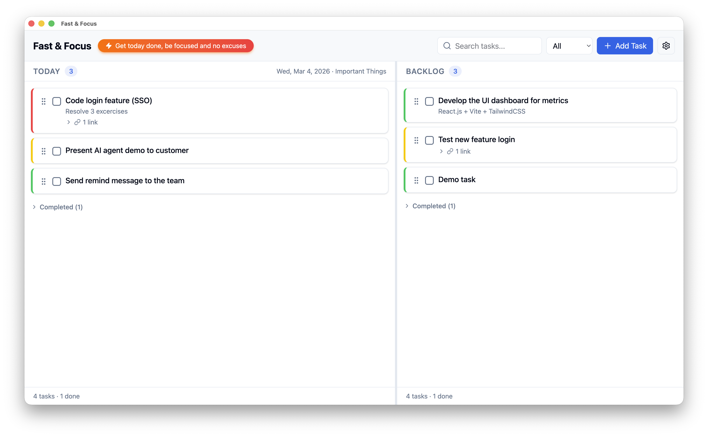

# Faster You – NeutralinoJS Edition

> A fast, secure, minimal task manager for web and desktop (macOS, Windows, Linux).



## Features

- **Two boards** — Today (focused work) and Backlog (everything else)
- **Task CRUD** — Add, edit, delete, and mark tasks done
- **Drag-and-drop** — Reorder tasks within a board or move between boards
- **Link tasks** — Connect tasks as related, blocks, or blocked by
- **Priority labels** — High (🔴), Medium (🟡), Low (🟢)
- **Search & Filter** — Find tasks by title; filter by All / Pending / Done
- **Import / Export** — JSON backup and restore via native file dialogs
- **Auto-cleanup** — Tasks older than N days are purged on launch (configurable)
- **Theme** — Light, Dark, or System
- **Local-first** — All data stored locally in SQLite (WebAssembly). No server required.

## Tech Stack

| Layer | Technology |
|-------|-----------|
| Frontend | React 19 + TypeScript + Tailwind CSS v4 |
| Desktop Shell | NeutralinoJS 5.4 |
| Database | SQLite via sql.js (WASM) |
| Drag & Drop | @dnd-kit |
| Data Fetching | TanStack Query |
| Build | Vite + NeutralinoJS CLI |


## Getting Started

### Prerequisites

- [Node.js](https://nodejs.org/) 20+
- [NeutralinoJS CLI](https://neutralino.js.org/) (`npm i -g @neutralinojs/neu`)

### Install

```bash
npm install
npx neu update    # download Neutralino binaries & client
```

### Development

```bash
npm run dev
```

This starts Vite on port 3000 and launches the Neutralino window pointing at it. Hot-reload works for all React changes.

You can also develop as a plain web app (shared SQLite via local API server):

```bash
npm run dev:web   # starts API server (port 3001) + Vite (port 3000)
```

All browsers share the same SQLite database at `~/.fasteryou/fasteryou.db`. Server logs are written to `.log/server.log`.

### Production Build

```bash
npm run build         # TypeScript check + Vite build → dist/
npx neu build         # package into platform binaries → dist/fasteryou-*
```

Or in one step:

```bash
npm run neu:build
```

Output binaries are in `dist/`:


### Run the Built App

```bash
npx neu run
```

## Scripts

Helper scripts for launching and stopping the web app are in `scripts/`:

| Script | Platform | Description |
| --- | --- | --- |
| `fasteryou-start.sh` | macOS / Linux | Start server + Vite and open browser |
| `fasteryou-start.bat` | Windows | Start server + Vite and open browser |
| `fasteryou-shutdown.sh` | macOS / Linux | Kill API server and Vite processes |
| `fasteryou-shutdown.bat` | Windows | Kill API server and Vite processes |

### macOS keyboard shortcut

1. Open **Shortcuts.app** → create a new shortcut
2. Add a **Run Shell Script** action pointing to `scripts/fasteryou-start.sh` (Shell: `/bin/bash`)
3. Click the shortcut name → **Add Keyboard Shortcut** → press your key combo (e.g. `⌘⌥F`)
4. Repeat for `fasteryou-shutdown.sh` with a different key (e.g. `⌘⌥K`)

### Windows keyboard shortcut

1. Install [AutoHotkey](https://www.autohotkey.com/)
2. Create an `.ahk` file:

   ```ahk
   ^!f::Run "C:\path\to\faster-you\scripts\fasteryou-start.bat"
   ^!k::Run "C:\path\to\faster-you\scripts\fasteryou-shutdown.bat"
   ```

3. Double-click the `.ahk` file to activate, or place in `shell:startup` to auto-load on login

## Data Storage

The SQLite database is persisted via:

- **NeutralinoJS mode** — `Neutralino.filesystem` writes to `<user-data>/fasteryou/fasteryou.db`
- **Web mode (with server)** — `~/.fasteryou/fasteryou.db` via `better-sqlite3` (shared across all browsers)
- **Web mode (no server)** — Falls back to IndexedDB in the browser

## License

MIT
